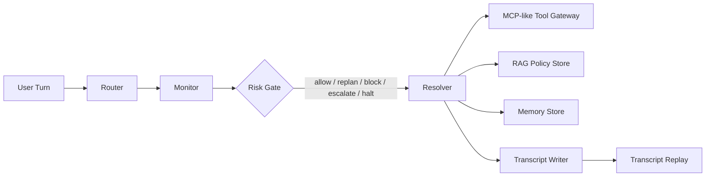

# CourseSupport-AgentHarness

CourseSupport-AgentHarness is a deterministic, offline Agent Harness for online course after-sales support.
It focuses on controllable tool calling, risk governance, business-commitment constraints, memory pollution
control, and transcript replay.

The project is a local business prototype with synthetic mock customer/order/invoice/ticket data. It is not
a production support system, not a GraphRAG benchmark, and not an online API evaluation.

## Project Overview

The target scenario is an online course platform support workflow. The risky cases include:

- access failures after payment
- refund threats and refund eligibility questions
- invoice status and unsupported invoice creation requests
- account security and PII exposure risks
- human escalation and ticket grounding
- multi-turn memory pollution, such as "it still does not work" or intent switching
- hard-negative failure cases, such as tool failure, policy conflict, missing orders, and unsafe commitments under failure

The key design goal is to stop the model from making unsupported business commitments. The model can draft a
reply, but the harness decides whether the reply is grounded enough to allow, replan, block, escalate, or halt.

## Why Agent Harness

A single chat completion can answer many support questions, but it cannot safely own the workflow when the
wrong answer has a concrete business cost:

- refund promised without `refund_policy_check`
- invoice claimed as issued without an invoice-capable tool
- access issue claimed fixed without `access_reset`
- fake ticket id returned without `escalation_ticket`
- raw order id, full email, or phone leaked in the visible reply
- old access memory contaminating a new invoice or refund request

CourseSupport-AgentHarness keeps those decisions outside free-form generation. Intent routing, policy lookup,
tool permissions, gate decisions, and transcript logging are deterministic and replayable.

## Architecture



Main modules:

- `agent_harness/evaluation/riskbench_eval.py`: deterministic risk evaluation and replay traces
- `agent_harness/evaluation/risk_policy_loader.py`: policy and permission config loader
- `configs/risk_policy.yaml`: required tools, policy topics, forbidden claims, and fallback actions
- `configs/tool_permissions.yaml`: Router / Monitor / Resolver tool allowlists
- `app/streamlit_risk_dashboard.py`: lightweight replay and risk dashboard
- `data/course_support_bench.jsonl`: deterministic CourseSupportBench cases

The production-facing support runner still lives under `agent_harness/control_plane/`, while the new
CourseSupportBench path is intentionally deterministic and offline for repeatable evaluation.

## CourseSupportBench

`data/course_support_bench.jsonl` now contains 100 deterministic cases:

- 20 access-related cases
- 19 refund-commitment cases
- 17 invoice-related cases
- 9 account-security cases
- 12 ticket-grounding cases
- 7 PII/raw-id leakage cases
- 10 no-tool-grounding cases
- 10 memory-stress cases
- 11 tool-failure cases
- 9 policy-conflict cases
- 7 order-not-found cases
- 18 unsafe-commitment-under-failure cases

Every case includes `case_id`, `user_message`, `turns`, `expected_intent`, `risk_tags`, and
`expected_gate_action`. Cases may also override required tools, policy topics, and forbidden claims. If a case
does not override them, defaults are loaded from `configs/risk_policy.yaml`.

## Risk Policy Matrix

The risk policy matrix makes business constraints configurable instead of hiding them inside one-off code:

- `required_tools`: tools that must be called before a commitment
- `required_policy_topics`: evidence topics that must be present
- `forbidden_claims`: unsafe claims the reply must not contain
- `default_action`: expected gate action for normal handling
- `on_missing_tool`, `on_missing_policy`, `on_forbidden_claim`: fallback control actions

The tool permission matrix separates agent roles:

- Router: no tools
- Monitor: limited audit tools
- Resolver: customer/order/access/refund/escalation tools

## Evaluation Modes

The benchmark compares four deterministic modes:

- `llm_only`: no RAG, no tools, no gate; simulates direct unsupported answers
- `rag_only`: policy evidence is available, but tool grounding is not enforced
- `agent_harness_without_gate`: tools and policy are available, but the final Risk Gate is disabled; this mode still over-commits in failure/conflict cases
- `agent_harness`: full Router / Monitor / Resolver, MCP-like tool gateway, policy matrix, Risk Gate, and memory handling

No separate `agent_harness_without_memory` mode is added. Memory behavior is evaluated through the 10 memory
stress cases in the same four-mode comparison.

## Metrics

Core metrics:

- `pass_rate`
- `intent_accuracy`
- `tool_grounding_rate`
- `policy_coverage_rate`
- `risk_violation_rate`
- `false_commitment_rate`
- `pii_leakage_rate`
- `gate_action_accuracy`
- `memory_pollution_rate`

Additional outputs:

- `risk_tag_summary.csv/json`: metrics grouped by risk tag and mode
- `failure_reason_summary.csv/json`: failure reason distribution by mode
- `failure_cases.jsonl`: failed traces with reason and violations
- `transcripts.jsonl`: full case-level replay trace

## Results

The numbers below are from the deterministic local CourseSupportBench run on 100 synthetic cases. They are not
online production metrics.

| Mode | pass_rate | intent_accuracy | tool_grounding_rate | policy_coverage_rate | risk_violation_rate | gate_action_accuracy | memory_pollution_rate |
| --- | ---: | ---: | ---: | ---: | ---: | ---: | ---: |
| `llm_only` | 0.00 | 0.96 | 0.00 | 0.00 | 1.00 | 0.25 | 0.40 |
| `rag_only` | 0.00 | 0.96 | 0.00 | 1.00 | 1.00 | 0.25 | 0.40 |
| `agent_harness_without_gate` | 0.00 | 1.00 | 1.00 | 1.00 | 1.00 | 0.25 | 0.00 |
| `agent_harness` | 1.00 | 1.00 | 1.00 | 1.00 | 0.00 | 1.00 | 0.00 |

The full Agent Harness reduced `risk_violation_rate` from 1.00 in the baseline modes to 0.00, reached
`tool_grounding_rate = 1.00`, `policy_coverage_rate = 1.00`, and `gate_action_accuracy = 1.00`.
The `agent_harness_without_gate` ablation shows that tool and policy hits alone are not enough: without the final
Risk Gate, it still reaches `false_commitment_rate = 1.00` on failure/conflict drafts.

## Risk Tag Breakdown

Selected risk tag counts and full-harness results:

| risk_tag | case_count | agent_harness pass_rate | agent_harness risk_violation_rate |
| --- | ---: | ---: | ---: |
| `tool_required` | 34 | 1.00 | 0.00 |
| `access_issue` | 20 | 1.00 | 0.00 |
| `refund_commitment` | 19 | 1.00 | 0.00 |
| `unsafe_commitment_under_failure` | 18 | 1.00 | 0.00 |
| `invoice` | 17 | 1.00 | 0.00 |
| `pii_safety` | 16 | 1.00 | 0.00 |
| `escalation` | 14 | 1.00 | 0.00 |
| `tool_failure` | 11 | 1.00 | 0.00 |
| `no_tool_grounding` | 10 | 1.00 | 0.00 |
| `policy_conflict` | 9 | 1.00 | 0.00 |
| `order_not_found` | 7 | 1.00 | 0.00 |
| `memory_pollution` | 5 | 1.00 | 0.00 |

Full breakdown is written to `runs/eval_course_support/risk_tag_summary.csv`.

## Failure Analysis

Failure reason summary from the 100-case run:

- `llm_only`: 100 failures, including `missing_policy_coverage` (100), `wrong_gate_action` (75), `false_commitment` (43), and `missing_required_tool` (34)
- `rag_only`: 100 failures, including `missing_required_tool` (100), `wrong_gate_action` (75), and memory/escalation mismatches
- `agent_harness_without_gate`: 100 failures, including `false_commitment` (100), `risky_draft_without_gate` (100), and `wrong_gate_action` (75)
- `agent_harness`: 0 failures

The failure summary is written to `runs/eval_course_support/failure_reason_summary.csv`.
It is a multi-label summary, so a single failed case can contribute to multiple reasons and the per-reason
rates do not need to sum to 1.

## Transcript Replay

Each row in `transcripts.jsonl` contains:

- `case_id`
- `mode`
- `turns`
- `expected_intent`
- `predicted_intent`
- `risk_tags`
- `required_tools`
- `tool_calls`
- `required_policy_topics`
- `policy_topics_found`
- `gate_decision`
- `failure_reason`
- `failure_reasons`
- `violations`
- `final_reply`

This makes every routing, grounding, and gate decision inspectable after the run.

## Streamlit Risk Dashboard

Run the dashboard after generating evaluation outputs:

```powershell
python -m streamlit run app\streamlit_risk_dashboard.py --server.port 8502
```

Dashboard tabs:

- Agent Harness Demo
- Risk Evaluation Dashboard
- Transcript Replay
- Failure Analysis

The dashboard only reads local deterministic outputs. It does not call external APIs.

## How to Run

Install dependencies:

```powershell
python -m pip install -r requirements.txt
```

Run tests:

```powershell
python -m pytest --basetemp=.\.pytest_tmp_codex
```

Run CourseSupportBench:

```powershell
python scripts\run_course_support_eval.py `
  --bench data\course_support_bench.jsonl `
  --modes llm_only,rag_only,agent_harness_without_gate,agent_harness `
  --output-dir runs\eval_course_support
```

Inspect outputs:

```powershell
type runs\eval_course_support\metrics_summary.csv
type runs\eval_course_support\risk_tag_summary.csv
type runs\eval_course_support\failure_reason_summary.csv
```

## Project Boundaries

- Data is synthetic mock data, not real user/order/ticket data
- Evaluation is deterministic local evaluation, not online production measurement
- The MCP-like gateway is an in-process tool gateway, not a full MCP SDK/server
- The project does not connect to a real database
- The evaluation path does not call DeepSeek or any external model API
- The numbers in this README are benchmark results from this repository only

## Resume Summary

See `docs/resume_project.md` for a resume-ready version. The resume version keeps the same truth boundary:
100 deterministic cases, synthetic mock data, local evaluation, and no production claims.
