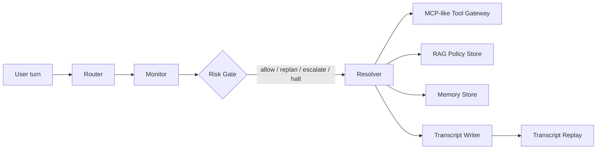

# CourseSupport-AgentHarness

CourseSupport-AgentHarness is a deterministic, offline Agent Harness for online course after-sales support.
It focuses on tool-call safety, risk governance, business-commitment constraints, memory pollution control,
and transcript replay.

This repository uses synthetic mock customer/order/invoice/ticket data only. It does **not** use real
production data, does **not** connect to a database, and does **not** call external model APIs in the
evaluation path.

## Project Overview

The project models a course platform support workflow for cases such as:

- course access failures
- refund threats
- invoice questions
- account security issues
- human escalation requests

The core idea is simple: the harness controls the workflow deterministically, while each response is
grounded by policy, tools, memory, and replayable traces.

## Why Agent Harness

A plain chat prompt is not enough for this scenario because the business cost of a wrong answer is real:

- promising a refund without checking policy
- claiming an invoice was issued without an invoice tool result
- saying an access issue is fixed when the tool failed
- leaking raw order ids or email addresses
- letting old access-related memory pollute a new invoice or refund turn

So the project emphasizes control over generation:

- Router handles initial intent routing
- Monitor checks high-risk route mismatch and evidence gaps
- Resolver generates replies only from verified policy evidence and tool results
- Risk Gate makes the final block / replan / escalate decision
- Transcript replay records the full path for debugging and review

## Architecture



Core modules:

- `agent_harness/control_plane/support_runner.py`
- `agent_harness/control_plane/support_gates.py`
- `agent_harness/control_plane/transcript.py`
- `agent_harness/mcp/support_gateway.py`
- `agent_harness/memory/store.py`
- `agent_harness/rag/store.py`
- `agent_harness/skills/support_playbooks.py`
- `agent_harness/sub_agents/support_agents.py`
- `agent_harness/evaluation/support_eval.py`
- `agent_harness/evaluation/riskbench_eval.py`

The current evaluation path is deterministic and offline. The harness shape is kept compatible with a live
LLM-backed workflow, but the benchmark does not require a real model to run.

## CourseSupportBench

`data/course_support_bench.jsonl` contains a deterministic evaluation set for the support workflow.

- 53 total cases
- 8 memory-stress cases
- covers access failure, refund threat, invoice query, account security, human escalation,
  PII leakage, missing tools, false commitment, and memory pollution
- compares four modes:
  - `llm_only`
  - `rag_only`
  - `agent_harness_without_gate`
  - `agent_harness`

Evaluation artifacts:

- `runs/eval_course_support/metrics_summary.json`
- `runs/eval_course_support/metrics_summary.csv`
- `runs/eval_course_support/failure_cases.jsonl`
- `runs/eval_course_support/transcripts.jsonl`

## Risk Policy Matrix

Risk rules are maintained as configuration, not scattered one-off checks.

- `configs/risk_policy.yaml`
- `configs/tool_permissions.yaml`

The policy matrix defines, per intent:

- required tools
- required policy topics
- forbidden claims
- fallback action when a tool or policy check is missing

The tool-permission matrix defines which agent role may call which mock tools.

## Evaluation Metrics

Key metrics reported by `agent_harness/evaluation/riskbench_eval.py`:

- `risk_violation_rate`
- `tool_grounding_rate`
- `policy_coverage_rate`
- `false_commitment_rate`
- `pii_leakage_rate`
- `gate_action_accuracy`
- `intent_accuracy`
- memory metrics:
  - `context_carryover_accuracy`
  - `intent_switch_accuracy`
  - `memory_pollution_rate`

## How to Run

Install dependencies first:

```powershell
python -m pip install -r requirements.txt
```

Run tests:

```powershell
python -m pytest --basetemp=.\.pytest_tmp
```

Run the deterministic evaluation:

```powershell
python scripts\run_course_support_eval.py `
  --bench data\course_support_bench.jsonl `
  --modes llm_only,rag_only,agent_harness_without_gate,agent_harness `
  --risk-policy configs\risk_policy.yaml `
  --tool-permissions configs\tool_permissions.yaml `
  --output-dir runs\eval_course_support
```

Run the Streamlit dashboard:

```powershell
python -m pip install streamlit
python -m streamlit run app\streamlit_risk_dashboard.py --server.port 8502
```

## Results

The numbers below come from the deterministic offline CourseSupportBench run in this repository.
They are **not** online production metrics.

| Mode | pass_rate | risk_violation_rate | tool_grounding_rate | policy_coverage_rate | gate_action_accuracy | memory_pollution_rate |
| --- | ---: | ---: | ---: | ---: | ---: | ---: |
| `llm_only` | 0.00 | 1.00 | 0.00 | 0.00 | 0.3774 | 0.50 |
| `rag_only` | 0.00 | 1.00 | 0.00 | 1.00 | 0.3774 | 0.50 |
| `agent_harness_without_gate` | 0.00 | 1.00 | 1.00 | 1.00 | 0.3774 | 0.00 |
| `agent_harness` | 1.00 | 0.00 | 1.00 | 1.00 | 1.00 | 0.00 |

On the current 53-case benchmark:

- the full harness reduced `risk_violation_rate` from `1.00` to `0.00`
- `tool_grounding_rate` reached `1.00`
- `policy_coverage_rate` reached `1.00`
- `gate_action_accuracy` reached `1.00`
- the 8 memory-stress cases reached `context_carryover_accuracy = 1.00`
- `intent_switch_accuracy = 1.00`
- `memory_pollution_rate = 0.00`

## Streamlit Risk Dashboard

`app/streamlit_risk_dashboard.py` is a lightweight view layer for the same offline artifacts.

Tabs:

- Agent Harness Demo
- Risk Evaluation Dashboard
- Transcript Replay
- Failure Analysis

The dashboard reads the evaluation outputs and does not call external APIs.

## Resume Summary

See `docs/resume_project.md` for a resume-ready 4-bullet summary with the real numbers used in this repo.

## Notes

- `runs/` and `.\.pytest_tmp\` are ignored and should not be committed
- no real user data is used anywhere in this repository
- no production deployment is included
- no live database connection is required
