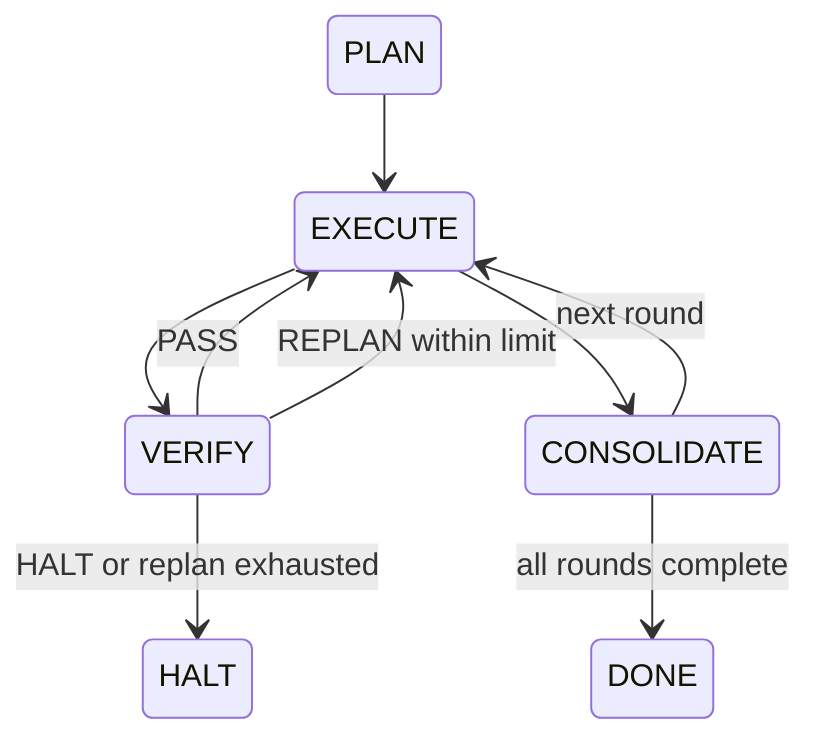

# PLAN-EXECUTE-VERIFY State Machine

状态说明：

- `PLAN`：Skills 生成确定性 Session Plan。
- `EXECUTE`：RAG 检索、Examiner 出题、候选人回答、Grader 评分。
- `VERIFY`：Gate 校验模型输出和工具审计。
- `CONSOLIDATE`：四层记忆跨层固化。
- `DONE`：所有轮次完成。
- `HALT`：工具越权、输出不可恢复或 Replan 超限。

